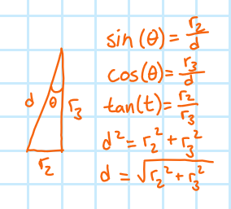

# Step One

 

This is the yo-yo system at
$t=0$. The *top* image is a general diagram and the *bottom* image is a more mathematical approach to the system. This is where the first definitions are made to begin building the equations of motion.

## Linear Kinematics
The yo-yo hasn't started to move yet, so we're free to say

$$\begin{gather*}
a(t)=0 & (1) \\
v(t)=0 & (2) \\
y(t)=y_{max}=r_{3} & (3)
\end{gather*}$$

The length of the string ($d$) in this position is

$$\begin{gather*}
d=\sqrt{r_{2}^2+r_{3}^2} & (4)
\end{gather*}$$

where
$d$ is the hypotenuse in a right triangle with short leg
$r_{2}$ and long leg
$r_{3}$ as shown below.

The angle
$\theta$ will sweep from left to right, with a maximum short leg magnitude of no more than
$r_2$ either to the left or to the right.

## Angular Kinematics
