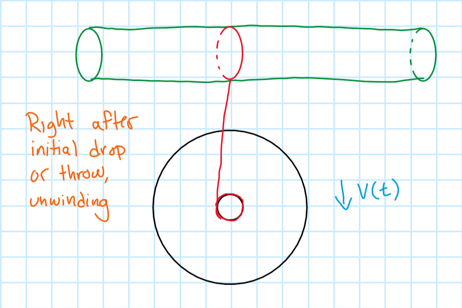
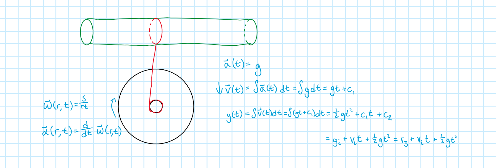

# Step Two

This is the yo-yo system at time
$t$ seconds after the yo-yo begins to fall down. The *top* image is a general view of the system and the *bottom* image is a more mathematical view of the system.

## Linear Kinematics
Now that the yo-yo is in motion, the equations in this moment will be a lot more interesting than the constant and two zeros from Step 1. The acceleration for the yo-yo will simply be the acceleration due to gravity, 
$g$.

$$\begin{gather*}
a(t)=g & (5)\\
v(t)=\int a(t)dt=\int gdt =gt+c_{1} & (6)\\
y(t)=\int v(t)dt= \int (gt+c_{1})dt=\frac{1}{2}gt^{2}+c_{1}t+c_{2} & (7)\\
\end{gather*}$$

These equations are the linear kinematic equations in terms of the vertical position, $y$, with a few constants, namely
$c_{1}$ and
$c_{2}$, that still need to be defined.
If the kinematic equations have been memorized, then the constants can be readily filled in. If they haven't been memorized, the constants can still readily be found with a bit of thinking.

In order to figure out the correct variable to assign to
$c_{1}$, it must be kept in mind that this is an equation for velocity as a function of time. Therefore, somewhere in the equation must be the initial velocity, 
$v_{i}$, (if there is one) given to the yo-yo. In this case,
$v_{i}=0$ because there is no "throw" of the yo-yo, it's simply allowed to fall.

Next is to find the constant
$c_{2}$ in equation $7$. This is the constant of integration for the position function, which alludes to the fact that 
$c_{2}$ will be the initial y-position,
$y_{i}=y_{max}$.

Now that
$c_{1}$ and
$c_{2}$ have been found, they can be substituted back into equations
$6$ and
$7$, keeping in mind that
$v_{i}=0$.

$$\begin{gather*}
v(t)=gt+c_{1} \\
=c_{1}+gt \\
=v_{i}+gt=gt & (6)\\
\\
y(t)=\frac{1}{2}gt^{2}+c_{1}t+c_{2} \\
=c_{2}+c_{1}t+\frac{1}{2}gt^{2} \\
=y_{i}+v_{i}t+\frac{1}{2}gt^{2} \\
=y_{max}+\frac{1}{2}gt^{2} & (7)\\
\end{gather*}$$