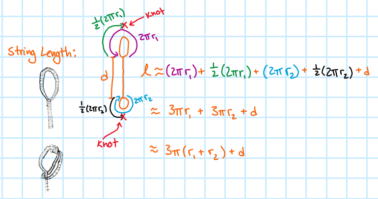

# Step Three

This is the yo-yo system at its lowest point. If the yo-yo stays here, it is said to be "sleeping". The *top* image is a general view of the system and the *bottom* image is a more mathematical view of the system.

## Linear Kinematics
Just like at the top of the path in Step 1, there is no linear movement. That makes the kinematics fairly simple

$$\begin{gather*}
a(t)=0 & (8) \\
v(t)=0 & (9) \\
y(t)=y_{min}=d+r_{2} & (10) \\
\end{gather*}$$

Equation $10$ has been written this way to show it in terms of variables that have already been assigned. Here, $d$ is at it's maximum while $y$ is at its minimum; a pattern that is reversed when $d$ is at its minimum.

At this moment in time, the entire length of the yo-yo string is being used. This makes it easy to write an expression for the length of the string:

$$\begin{gather*}
l=(2 \pi r_{1})+\frac{1}{2}(2 \pi r_{1})+(2 \pi r_{2})+\frac{1}{2}(2 \pi r_{2})+d
\end{gather*}$$

- $(2 \pi r_{1})$ is the circumference of the "finger" cylinder which has one full wrap
- $\frac{1}{2}(2 \pi r_{1})$ is used to account for the half wrap around the finger that arises from the slip knot style of the top of the yo-yo string. It is doubled over on itself in a way that creates an extra half-wrap to create the loop of the slip knot
- $(2 \pi r_{2})$ is the circumference of the central shaft of the yo-yo
- $\frac{1}{2}(2 \pi r_{2})$ is used to account for the half wrap around the central shaft of the yo-yo that arises from the slip knot style of the bottom of the yo-yo string. It is doubled over on itself in a way that creates an extra half-wrap to create the loop of the slip knot
- $d$ is the length of yo-yo string between $y=0$ and the top of the central shaft of the yo-yo

The string length expression is designed to account for the major lengths of string used in the system. The term "major lengths" is used to illustrate that no effort has been made to account for the lengths of string used to tie knots. That is, this expression accounts for all lengths of string *outside* any knots. The image below is meant to be a graphical representation of the terms in the expression.

## Angular Kinematics