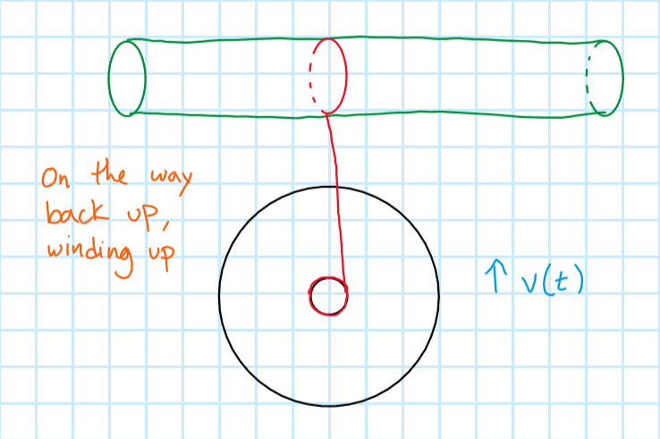
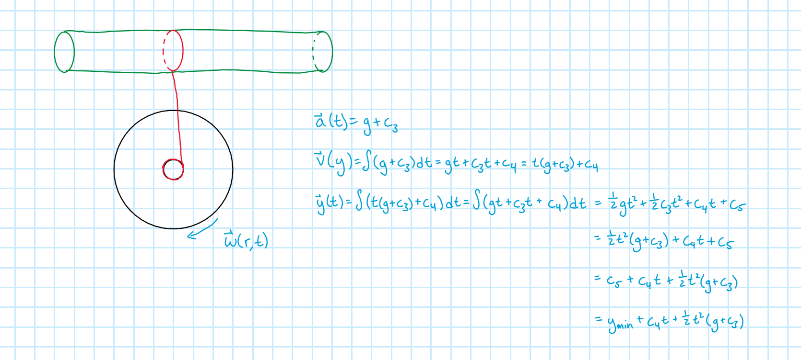

# Step Four

This is the yo-yo system on its way back up the string. This is the most interesting step in the process because the yo-yo, very unnaturally, moves *against* gravity and climbs the string back up to the cylinder.

## Linear Kinematics
The yo-yo is back in motion, so the linear kinematics will be more than just constants and zeros.

$$\begin{gather*}
\vec{a}(t)=g+c_{3} & (11) \\
\vec{v}(t)=\int \vec{a}(t)=\int (g+c_{3})dt=gt+c_{3}t+c_{4}=t(g+c_{3})+c_4 & (12) \\
y(t)=\int \vec{v}(t)=\int (t(g+c_{3})+c_4)dt=\frac{1}{2}gt^{2}+\frac{1}{2}c_{3}t^2+c_{4}t+c_{5} \\
\end{gather*}$$

The equation for $y(t)$ can be rearranged and simplified

$$\begin{gather*}
y(t)=\frac{1}{2}gt^{2}+\frac{1}{2}c_{3}t^2+c_{4}t+c_{5} \\
=c_{5}+c_{4}t+\frac{1}{2}t^2(g+c_{3}) \\
\end{gather*}$$

Once again, in this form
$y(t)$ looks just like a linear kinematic equation with some constants that need to be identified. Just as in Step Two, the fact that this is a position function alludes to the fact that the lone constant, 
$c_{5}$, will be the initial position *of this movement*. That means that the initial position for this step is the *lowest* point of the yo-yo path,
$y_{min}$. The constant
$c_{4}$ will coincide with the initial velocity,
$v_{i}$ that the yo-yo has to start climbing the string again. 

The last constant,
$c_{3}$ is going to require some thought and further investigation to determine. It is a modifier of the acceleration, which makes sense because the yo-yo has to be accelerating *faster* than the value of g in order to climb the string again.

$$\begin{gather*}
y(t)=c_{5}+c_{4}t+\frac{1}{2}t^2(g+c_{3}) \\
=y_{min}+\vec{v}_{i}t+\frac{1}{2}t^2(g+c_{3}) \\
\end{gather*}$$

where all that is known now is that
$c_{3} > 0$.

## Investigation of $c_{3}$
The constant
$c_{3}$ is some modifier to the acceleration term. It could be torque. 